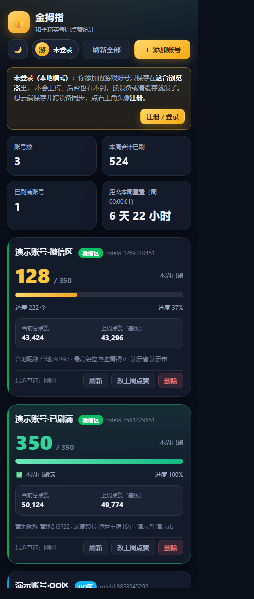
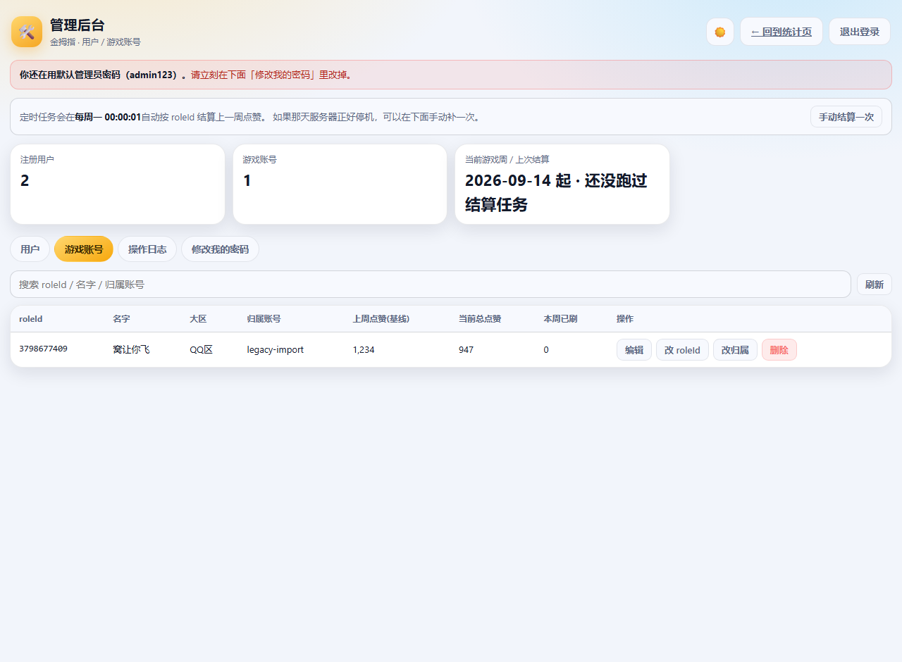

# 金拇指 · 和平精英每周点赞统计工具（网页版）

打开网页就能看到每个账号**本周已经刷了多少点赞**，不用再拿「当前总点赞 − 上周点赞数」手算。



- 📱 **移动端优先**：手机上打开就是最适合的布局，可加到主屏幕当 App 用
- 🃏 **圆角卡片列表**：本周已刷大字显示 + 350 上限进度条 + 当前总点赞 / 上周点赞（基线）
- 🔄 **进页面自动刷新**：打开网页、手机下拉刷新、切回标签页都会自动查一次最新点赞（只调接口 B）
- 🌗 **深色 / 浅色模式**：跟随系统，也可手动切换
- 🔁 **周自动结算**：游戏周从**周一 00:00:01** 算起，跨周后基线由服务器自动推进，不用再手填
- 🔌 **已接入真实接口**：接口 A（昵称+大区→roleId）/ 接口 B（roleId→点赞数），地址与字段名都在配置里
- 👤 **默认本地模式**：不登录也能用，游戏账号只存在**你这台浏览器**里，不上传、后台看不到
- ☁️ **注册即上云**：点左上角头像注册（只要账号 + 密码），可把本机攒的账号一键同步到云端，换设备登录就能看到
- 🗄️ **SQLite 数据库**：用户 / 游戏账号 / 操作日志；账号表里存 roleId、名字、大区、上周点赞(基线)、当前总点赞
- 🛠️ **管理员后台**：管用户、管游戏账号（改名 / 大区 / 基线 / 当前点赞 / roleId / 归属 / 删除）

---

## 一、在本机跑起来（Windows / macOS / Linux 都一样）

只需要 **Node.js 22.5 或更高版本**（推荐 24 LTS；用了内置 SQLite，**不需要 `npm install`**，也没有任何第三方依赖）。

### 最省事：双击 `启动服务.bat`

双击项目根目录的 **`启动服务.bat`** 就行，窗口里会直接打印出访问地址、数据库位置和管理员账号：

```
  👍 金拇指 · 和平精英每周点赞统计工具 已启动

  电脑上打开：http://127.0.0.1:8787
  手机上打开（需连同一个 WiFi）：
      http://10.161.35.18:8787   [WLAN]

  数据库：...\data\kimuzhi.db
  用户 1 个 / 游戏账号 0 个 / 点赞记录 0 条
  管理员：admin  ← 默认密码，请尽快修改
  管理后台：http://127.0.0.1:8787/admin.html
```

**关掉这个窗口服务就停了**；想让它开机自动跑起来，右键
`scripts\install-autostart.ps1` → 「使用 PowerShell 运行」即可
（取消：加 `-Remove` 参数再运行一次，或在 `shell:startup` 里删掉那个快捷方式）。

### 命令行方式

```powershell
cd "C:\Users\admin\Desktop\和平精英金拇指网页"
npm start          # 等价于 node server/index.js
```

- 电脑上打开：<http://127.0.0.1:8787>（默认**未登录 = 本地模式**，直接就能用）
- 管理后台：<http://127.0.0.1:8787/admin.html>（首次启动的默认管理员 `admin` / `admin123`，
  **请立刻改密码**；也可以在 `.env` 里用 `ADMIN_USERNAME` / `ADMIN_PASSWORD` 指定）
- **手机上打开**：手机和电脑连同一个 WiFi，用启动时打印的那个 `http://<局域网IP>:8787`
- 默认走**真实接口**（`.env` 里 `ADAPTER=http`）：第一次「添加账号」会真的查一次接口 A（角色名 + 大区），
  之后每次刷新走接口 B。只想看界面、不想查真实角色时，把 `ADAPTER` 改成 `mock` 即可。
  不想让任何访客使用本地模式的话，在 `.env` 里设 `ALLOW_LOCAL_MODE=0`。
- 想先看看卡片效果（不查真实接口、不消耗任何调用）：在 `.env` 里把 `ADAPTER` 改成 `mock`，重启后执行
  `npm run seed:demo` 造 3 个演示账号（清理：`npm run seed:clean`），看完再改回 `http`。
  ⚠️ Mock 造出来的 roleId 在真实接口里是查不到的，切换模式前记得先 `npm run seed:clean`。

其他常用命令：

```powershell
npm run dev        # 改代码自动重启
npm test           # 跑全部单元测试 + 接口契约 + 本地模式 + 用户/管理员/定时任务（80 个用例，零依赖）
npm run smoke      # 对正在运行的服务做端到端冒烟测试（真实接口模式下默认只跑只读检查）
npm run ui:check   # 用无头 Chrome/Edge 真实点一遍界面（需要本机装有浏览器）
                   #   mock 模式：全流程 23 项；真实接口模式：只读 6 项，不会白花一次接口调用
                   #   想在真实接口下也测「添加账号」：node scripts/ui-check.mjs --nickname 角色名 --zone 1
npm run check      # 语法检查
```

---

## 二、目录结构

```
├─ server/                后端（零依赖，只用 Node 内置模块 + 内置 node:sqlite）
│  ├─ index.js            入口：HTTP 服务 + 静态资源 + 定时任务
│  ├─ api.js              接口路由（auth / accounts / admin）
│  └─ lib/
│     ├─ db.js            ★ SQLite 建表与版本化迁移
│     ├─ repo.js          数据访问层（所有 SQL 都在这，换 MySQL 只改它）
│     ├─ auth.js          注册/登录、PBKDF2 密码哈希、会话
│     ├─ admin.js         管理员后台业务逻辑
│     ├─ local.js         ★ 本地模式（未登录）：无状态换算，不落库
│     ├─ config.js        配置（环境变量 > config/endpoints.json > 默认值）
│     ├─ service.js       业务编排：加账号 / 刷新 / 改基线 / 周结算
│     ├─ settlement.js    ★ 跨周结算引擎（基线怎么推进）
│     ├─ legacy-import.js 旧版 JSON 数据一次性导入
│     ├─ jobs/weekly.js   每周一 00:00:01 的定时结算任务
│     └─ adapters/        接口适配器：mock.js（假数据）/ http.js（真实接口）
├─ shared/                前后端共享：常量 + ★ 游戏周计算 week.js
├─ public/                前端（原生 ES Module，无构建步骤）
│  ├─ index.html  styles.css         主页面
│  ├─ admin.html  admin.css          管理后台
│  └─ js/{app.js, admin.js, api.js, format.js}
├─ tests/                 单元测试 + 接口契约 + 本地模式 + 用户体系 + 管理员 + 定时结算（80 个用例）
├─ scripts/               冒烟测试、界面自动校验、演示数据、创建管理员、开机自启
├─ deploy/                部署脚本与 Nginx / systemd 配置
├─ docs/                  截图等文档素材
├─ config/endpoints.json   ★ 真实接口配置（地址 / 参数名 / 响应字段名 / 成功码）
└─ data/kimuzhi.db         SQLite 数据库，运行后自动生成（已 gitignore）
```

---

## 三、核心逻辑（需求文档第三、六节）

**公式：本周已刷 = 当前总点赞 − 上周点赞（基线）**，每次刷新实时计算。

### 0. 什么时候会自动刷新点赞

| 时机 | 行为 |
|---|---|
| 打开网页 / 手机**下拉刷新** | 自动查一遍名下每个账号的最新点赞（`GET /?roleId=` 接口 B，不消耗搜索额度） |
| 切回这个标签页 | 同上，但 1 分钟内不重复刷（避免来回切标签疯狂请求） |
| 每 5 分钟 | 后台静默刷一次 |
| 手动点「刷新」/「刷新全部」 | 立刻刷，并弹出提示 |

刷新**只更新点赞数**——昵称、大区、roleId、头像、最高段位、地区这些都保持原样。
（当前段位、王牌印记、K/D、注册时间每次查都会变，只在添加账号时能抓到一次，
显示出来会看到过期的数字，所以不显示也不抓。）
（头像属于「不会变」的字段，添加账号时抓一次并显示在卡片上；没抓到或图片加载失败时显示首字圆形色块。）

### 1. 游戏周的边界

游戏周从**周一 00:00:01** 开始（周一 00:00:00 这一秒仍算上一周）：

| 时刻 | 属于哪一周 |
|---|---|
| 周一 00:00:00 | 上一周 |
| 周一 00:00:01 | 新的一周 |
| 周日 23:59 | 本周（周一 00:00:01 起算的那一周） |

实现见 `shared/week.js`，按 `Asia/Shanghai` 时区计算（不依赖服务器本地时区，UTC 服务器也不会算错），
边界用例被 `tests/week.test.js` 覆盖（含 00:00:00 / 00:00:01 只差 1 毫秒的连续性和时区差异）。

### 2. 上周点赞数从哪来

| 时机 | 来源 |
|---|---|
| 第一次添加账号 | 用户在表单里**手填** |
| 之后每周 | **服务器**自动结算，不再需要输入 |

### 3. 跨周结算的取值规则（最容易写错的地方）

进入新的一周时，新基线取**刷新之前记录的点赞数**（上一周结束时的快照），
**不能**用刚查到的最新值——否则本周新刷的点赞会被算进基线，结果偏小。

所以刷新账号的顺序永远是「**先结算，再查询**」（`server/lib/service.js` 的 `refreshAccount`）：

```
1. settleAccount()  ← 用上周的快照推进基线
2. adapters.fetchLikes()  ← 再查最新总点赞
3. 本周已刷 = 新点赞 − 新基线
```

如果用户隔了好几周没打开，就用**最近一次快照**作为新基线，并在卡片上提示这是估算值，建议刷新确认。

### 4. 数据异常处理

- 「当前总点赞 < 上周点赞」时，已刷数**不会显示成负数**，而是显示 0 + 红色异常提示，
  点「修正」即可手动改「上周点赞数」；
- 同一个 roleId 全库唯一：自己重复添加会被提示，别人加过的角色也不会把对方信息暴露给你。

### 5. 每周结算（不再单独存点赞历史）

每个游戏账号在数据库里只保留两个数：**上周点赞（基线）** 和 **当前总点赞**。
不单独存每周的点赞历史记录表——需要看历史时，用「当前总点赞 − 上周点赞」就够了。

每周一 00:00:01，定时任务会：

```
1. 遍历数据库里所有 roleId，用接口 B 查一次点赞数；
2. 把这个值写成新一周的「上周点赞(基线)」（来源标记为 cron）；
3. 于是新的一周「本周已刷」从 0 重新开始。
```

服务内部每 15 秒检查一次「这一周是否已经结算过」（标记存在 `settings` 表里），
所以进程重启、机器休眠、错过时间点都能自愈，不会重复结算也不会漏。
万一周一服务器正好停机，也可以在后台点「手动结算一次」补上。

---

## 四、本地模式与账号体系

### 未登录 = 本地模式（默认）

- 打开页面**不会**创建任何账号，也不需要登录，直接就能添加游戏账号。
- 这些账号只存在**浏览器 localStorage** 里：服务器一个字节都不存，管理后台也看不到，
  换设备 / 清缓存就没了。接口 A / 接口 B 仍由服务端代理调用，所以接口密钥不会暴露到浏览器。
- 打开页面时服务端只帮忙做一次「跨周结算」（不联网、不落库）；点「刷新」才真的去查点赞数。

### 注册后数据上云

- **点左上角头像 → 注册**：只要**账号 + 密码**（不做邮箱/短信验证）。
- 注册时会问一句「要不要把这台浏览器上的 N 个账号同步到云端」，选是就一次性搬过去
  （这些账号已经带 roleId 和基线，不会重复消耗接口 A 的查询）。
- 之后换任何设备登录同一个账号，账号列表从云端同步下来（`tests/api.test.js` 有断言覆盖）。
- **密码**：PBKDF2-SHA256 + 随机盐哈希存储，绝不存明文；管理员重置密码会把该用户已登录的设备踢下线。
- 未登录时界面里**没有**任何「修改密码」相关入口（那是登录之后才有的）。

### 管理后台 `/admin.html`



普通页面里**没有**单独的后台按钮：有管理员权限时，**点左上角头像打开账号设置**，里面就会出现「管理后台」入口
（没权限的账号看不到这个入口，直接在地址栏敲 `/admin.html` 也进不去）。

用管理员账号登录后可以：

| 能力 | 说明 |
|---|---|
| 用户管理 | 查看全部注册用户、设为/取消管理员、重置密码、删除用户 |
| 游戏账号管理 | 改名 / 改大区 / 改上周点赞（基线）/ 改当前点赞、**改 roleId**、**改归属**、删除 |
| **公告** | 编辑统计页最下面那张「公告」卡片的内容（留空 = 不显示这张卡片），换行原样保留，最长 500 字 |
| 每周结算 | 显示当前游戏周与上次结算时间，可**手动补跑一次** |
| 操作日志 | 所有管理员改动都留痕（谁、什么时候、改了什么） |

删除用户会**级联删除**他名下的游戏账号。游客的账号不在数据库里，所以后台看不到、也删不到。

> 公告存在 `settings` 表的 `announcement` 键里（不用改库结构），通过 `GET /api/config` 下发给统计页；
> 管理员接口是 `GET / PATCH /api/admin/settings`。改完刷新统计页即可看到。

### 两种管理员

| 层级 | 能力 |
|---|---|
| **超级管理员**（全站唯一） | 上面全部能力 + 管理管理员（提升/降级/删除/重置密码）。**不能被降级、不能被删除、别人也不能重置它的密码** |
| 普通管理员 | 能进后台、能管游戏账号与每周结算；**不能**动任何管理员（会提示「只有超级管理员能设置管理员」） |

- 超级管理员由**系统指定**：`.env` 里的 `ADMIN_USERNAME`（没配就是默认的 `admin`）就是那唯一的一个。
  把这个值改成别的账号名并重启，超级管理员就会移交给它（原账号降为普通管理员，不删号）。
- 界面上**不提供**「把某人设为超级管理员」的操作——数据库层也用唯一索引锁死了，全站最多一个。
- 要换人（或忘记密码）：命令行 `npm run admin -- --list` 看现状，
  `npm run admin -- 账号名 --super` 移交超级管理员，`npm run admin -- 账号名 --reset 新密码` 重置密码。

> 后台地址：`/admin.html`。默认超级管理员是 **admin / admin123**，请尽快改密码。

命令行也可以：

```powershell
npm run admin -- --list                  # 列出所有用户，并标出谁是超级管理员
npm run admin -- 你的账号 你的密码         # 创建/重置为普通管理员
npm run admin -- 某账号 --promote          # 把已有用户提为普通管理员
npm run admin -- 某账号 --super            # 把超级管理员移交给它（全站唯一）
npm run admin -- 某账号 --reset 新密码      # 重置密码（忘记密码时用）
```

---

## 五、接口层（已接入真实接口）

用的是「和平营地 roleId 查询 API」（一个入口两个接口，`GET /?id=角色名&zone=1` / `GET /?roleId=xxx`）。
配置全在 `config/endpoints.json`，**改接口只改这个文件，不动业务代码**。

| 用途 | 走哪个接口 | 说明 |
|---|---|---|
| 添加账号 | **接口 A** `?id=昵称&zone=大区` | 换到隐藏 roleId，同时带回点赞数（以及最高段位、地区这些不会过期的档案） |
| 刷新点赞数 | **接口 B** `?roleId=xxx` | 只打荣耀接口，比 A 轻得多，日常刷新全走它 |

### 已经踩过的坑（都已在代码里处理，改配置前先看一眼）

| 坑 | 处理方式 |
|---|---|
| **HTTP 状态码恒为 200**，失败也返回 200，真实成败写在 body 的 `code` 里 | 配置 `successPath: "code"` / `successValue: 200`，绝不按 HTTP 状态判断 |
| **`zone`：`1` = QQ区，`2` = 微信区**（容易写反） | `apiA.regionCodes` 里配死；界面上的「微信区」会翻成 `2` |
| **`likeTimes` 是字符串，可能是 `null`** | 单独解析；`null` 会当成「没取到」并报错，**不会当成 0** |
| **roleId 最大 42 亿**，超过 32 位整数上限 | 全程按字符串存/传，绝不 `Number()` |
| 接口可能提示「请求过于频繁」 | 自动退避重新请求（`retryOnRateLimit`，默认 3 次）；**不做主动限速、不管额度** |
| 错误码是字符串（`NOT_FOUND` / `BAD_ROLEID` / `ALL_TOKENS_EXHAUSTED`…） | 翻成中文提示直接显示在页面上，并映射成合适的 HTTP 状态给前端 |
| 反代可能把 JSON 换成 HTML 错误页 | 报「返回的不是 JSON」，一眼能看出是被中间层拦了 |

### 要改的东西

```powershell
# 1) 接口地址/字段名（一般不用动，已填好）
notepad config\endpoints.json

# 2) 访问密钥：接口服务在管理界面设了密钥才需要，写 .env（不会被提交、不会被部署覆盖）
#    在 .env 里加一行： API_KEY=你的密钥

# 3) 切回假数据演示（不碰真实接口）
#    在 .env 里把 ADAPTER=http 改成 ADAPTER=mock，重启即可
```

只想用环境变量配置接口时，`API_BASE_URL=https://hp.likeun.com/` 加 `ADAPTER=http` 就够了（两个接口共用该地址）。

**提示**：添加账号会真的查一次接口 A。如果只是想看界面效果，用 `npm run ui:check` 或把 `ADAPTER` 切到 `mock`，不会消耗任何接口调用。

---

## 六、部署到 Linux 服务器

### 方式 A：一键脚本（推荐）

服务器需要能 SSH 登录；**Node.js ≥ 22.5（内置 SQLite），推荐 24 LTS**（部署脚本会检测并给出安装命令）。

**Windows（PowerShell）：**

```powershell
pwsh deploy/deploy.ps1 -Target root@你的服务器IP -Domain 你的域名或IP -Nginx
```

**macOS / Linux / Git Bash：**

```bash
bash deploy/deploy.sh root@你的服务器IP --domain 你的域名或IP --nginx
```

脚本会自动完成：打包上传 → 备份数据库 → 解压新代码 → 创建 `kimuzhi` 系统用户 →
写 `.env` → 安装并启动 systemd 服务 → 健康检查 → 配置 Nginx 反向代理。

**以后每次更新代码，重复执行同一条命令即可**：只替换代码，`data/kimuzhi.db` 和 `.env` 会保留，
数据库会自动备份到 `/opt/kimuzhi/backups/`（保留最近 10 份）。

### 方式 B：手动部署

```bash
# 服务器上执行
curl -fsSL https://deb.nodesource.com/setup_24.x | sudo -E bash -   # 装 Node 24
sudo apt-get install -y nodejs nginx
sudo mkdir -p /opt/kimuzhi
# 把项目文件传到 /opt/kimuzhi（可用 scp / git clone）
cd /opt/kimuzhi
sudo cp .env.example .env && sudo nano .env   # HOST 改 127.0.0.1，并配好 ADMIN_USERNAME/ADMIN_PASSWORD
sudo cp deploy/kimuzhi.service /etc/systemd/system/kimuzhi.service
sudo systemctl daemon-reload && sudo systemctl enable --now kimuzhi
sudo cp deploy/nginx.conf /etc/nginx/conf.d/kimuzhi.conf
sudo nano /etc/nginx/conf.d/kimuzhi.conf      # 把 server_name 改成你的域名
sudo nginx -t && sudo systemctl reload nginx
curl http://127.0.0.1:8787/api/health
```

### 方式 C：Docker

```bash
docker compose up -d --build
docker compose logs -f
```

### 上线后建议做的事

1. **云服务器安全组放行 80 / 443 端口**（只打算内网用就放行你的端口即可）；
2. **马上改掉管理员密码**：登录 `/admin.html` → 「修改我的密码」，
   或在 `.env` 里配 `ADMIN_USERNAME` / `ADMIN_PASSWORD` 后重启；
3. 有域名的话签个 HTTPS 证书，手机上才能「添加到主屏幕」长期使用：
   `certbot --nginx -d 你的域名`；
4. 验证部署：`node scripts/smoke.mjs http://127.0.0.1:8787`（只读检查应全部通过；
   想连「添加账号」一起测就加 `--nickname 你的角色名 --zone 1`）。

---

## 七、日常运维

```bash
systemctl status kimuzhi          # 看状态
journalctl -u kimuzhi -f          # 看实时日志
systemctl restart kimuzhi         # 重启
npm run admin -- --list           # 列出所有用户（在 /opt/kimuzhi 下执行）
npm run admin -- admin 新密码      # 忘记管理员密码时重置
```

**备份数据库**（用户、游戏账号、点赞记录全在里面，一个文件搞定）：

```bash
# 建议先 checkpoint 把 WAL 内容并回主文件，再复制
sqlite3 /opt/kimuzhi/data/kimuzhi.db "PRAGMA wal_checkpoint(TRUNCATE);" 2>/dev/null || true
cp /opt/kimuzhi/data/kimuzhi.db ~/kimuzhi-$(date +%F).db
```

（部署脚本每次升级都会自动备份到 `/opt/kimuzhi/backups/`，不用自己操心。）

定时任务说明：服务内部每 15 秒检查一次「这一周是否已经结算过」。
只要在**周一 00:00:01 之后的 10 分钟宽限窗口内**服务是活着的（含刚重启），
就会遍历数据库里所有 roleId 查询并记录上一周点赞数；如果整段时间服务都停着，
下次打开页面时也会用最近一次快照自动推进基线，不会算错。

---

## 八、开发进度（对应需求文档第七节 + 后续追加需求）

| 版本 | 内容 | 状态 |
|---|---|---|
| 第一版 | 添加账号（昵称+大区+手填上周点赞）、多账号圆角卡片、本周已刷实时计算 + 350 进度条 + 刷新、本地存储 | ✅ 已完成 |
| 第二版 | 修改上周点赞、删除账号、错误提示完善、重复 roleId 拦截、深色/浅色模式 | ✅ 已完成 |
| 第二版 | **接入真实接口 A / B** | ✅ 已完成（和平营地 roleId 查询 API，配置在 `config/endpoints.json`） |
| 第三版 | 服务器端：数据库 + 每周一凌晨定时结算任务 | ✅ 已完成 |
| 第四版 | **SQLite 数据库**（users / sessions / roles / audit_logs / settings） | ✅ 已完成 |
| 第五版 | **默认本地模式**：未登录时账号只存浏览器、不入库、后台不可见；注册后可一键上云 | ✅ 已完成 |
| 第五版 | **去掉每周点赞记录表**：只保留上周点赞(基线) + 当前总点赞 | ✅ 已完成 |
| 第五版 | 修复账号弹窗三张表单同时显示的 CSS bug，注册界面只留账号 + 密码 | ✅ 已完成 |
| 第五版 | **超级管理员**：全站唯一（数据库唯一索引锁死），不能被降级/删除，普通管理员不能动管理员层级 | ✅ 已完成 |
| 第五版 | 卡片只留会刷新的数据（去掉当前段位/印记/K/D/注册时间/基线来源），进页面与下拉刷新自动刷新点赞数 | ✅ 已完成 |
| 第六版 | 卡片恢复游戏头像（接口A 添加时抓一次，加载失败退回首字色块）；顶栏改为 QQ 风格（左上角头像+昵称，右上角 ＋ 添加账号） | ✅ 已完成 |
| 第六版 | **界面改为简约风格**：全站只用中性灰 + 一个强调色（只用在「＋」和进度条），去掉背景光晕 / 大区彩色条 / 绿色刷满态 / 彩色徽章与提示底色；手机端「＋」贴屏幕右边缘；管理后台入口移进账号设置弹窗 | ✅ 已完成 |
| 第六版 | 卡片精简（去掉 roleId /「本周已刷」/ 进度百分比，删除按钮移到昵称右侧）；进度条改灰白斜条纹；底部说明卡换成**管理员可编辑的公告**（后台「公告」标签页） | ✅ 已完成 |
| 第四版 | **游戏周改为周一 00:00:01**，按 roleId 请求并记录上一周点赞 | ✅ 已完成 |
| 第四版 | **管理员后台**：用户 / 游戏账号 / roleId / 上周点赞记录 增删改 + 操作日志 | ✅ 已完成 |

---

## 九、常见问题

**Q：手机打不开电脑上的页面？**
确认手机和电脑在同一 WiFi；用电脑的局域网 IP（`ipconfig` 看 IPv4，一般 `192.168.x.x`）；
Windows 防火墙要允许 Node.js 访问专用网络；公司/公共 WiFi 常开启「AP 隔离」会阻止设备互访。

**Q：换手机 / 换浏览器后看不到我的账号？**
未登录时账号只存在原来那台浏览器的 localStorage 里，换设备自然看不到。
在原来那台设备上**注册**（会把本机账号一起同步到云端），之后新设备登录同一账号就能看到。

**Q：忘记超级管理员密码了？**
在项目目录执行 `npm run admin -- admin 新密码`（直接改数据库，不用启动服务）；
想换人就用 `npm run admin -- 新账号 --super`；`npm run admin -- --list` 可以看现状。

**Q：卡片显示的数字大得离谱？**
只有用 Mock 假数据（`ADAPTER=mock`）时才会——它按「从 2024 年起累积」生成总点赞，和手填的基线对不上。
用真实接口时数字就是游戏里的真实值；万一填错了，点「改上周点赞」修正即可。

**Q：第一次添加账号，不知道「上周点赞数」填多少？**
打开游戏主页看当前点赞值：知道上周的值就照填；不知道就直接填**当前值**，本周从 0 开始算，
下周一 00:00:01 服务器会自动结算出真实基线，之后就不用再管了。

**Q：接口报「token 全部失效或额度用尽」？**
这是接口服务那侧的事（它的 token 过期或额度用完），本项目只是把它的提示原样翻成中文显示出来。
去接口服务的管理后台处理即可；已经查到过的数据不会丢，页面照常显示上次的结果。

**Q：误删了账号 / 用户怎么办？**
删除是级联的（删用户 → 他的游戏账号 → 它的点赞记录），删了就没了。
所以升级前会**自动备份数据库**：`/opt/kimuzhi/backups/`（本机是 `data/kimuzhi.db`），
把备份的 `.db` 覆盖回去重启即可。

**Q：端口 8787 被占用？**
改 `.env` 里的 `PORT`，或临时用 `$env:PORT=9000; npm start`。

**Q：数据存在哪？**
- 未登录（本地模式）：只在浏览器的 localStorage 里，服务器不存。
- 登录后：`data/kimuzhi.db`（SQLite）。账号表存 roleId、名字、大区、上周点赞(基线)、当前总点赞；
  名字只是给你看的备注，管理员可以随时改。

**Q：为什么后台看不到我用本地模式加的账号？**
那是设计如此：没登录时账号只存在你这台浏览器里，等同于「不绑定任何账号」。
注册（或登录后导入）之后就会出现在云端和后台。

**Q：怎么去掉游客/本地模式？**
在 `.env` 里设 `ALLOW_LOCAL_MODE=0`，未登录时添加账号会直接提示需要先注册。
